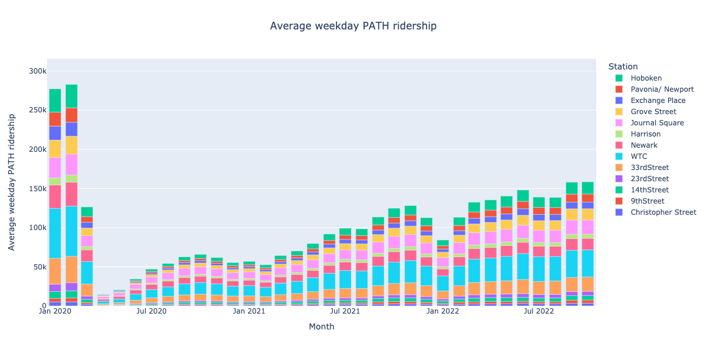
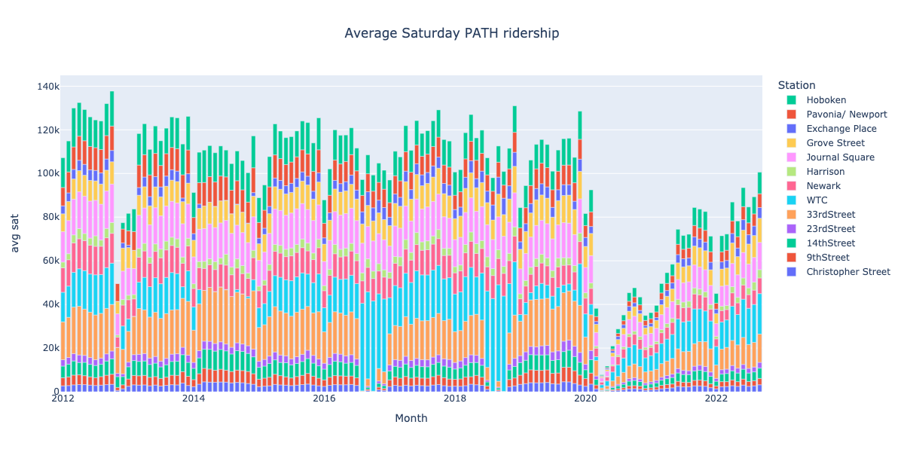

# PATH ridership stats
Cleaned + Plotted Port Authority data from https://www.panynj.gov/path/en/about/stats.html

### Jan 2012 – Sept 2022

### Jan 2020 – Sept 2022

### Saturdays

Cleaned data:
- [`data/all.pqt`]
- [`data/all.xlsx`]
- [Google Sheet](https://docs.google.com/spreadsheets/d/1u84kVHEjvqByCu8Jb78D9f7TXbahoOe0/edit)

## Methods

### 1. Download "PATH Ridership Reports (By Month)"
- from https://www.panynj.gov/path/en/about/stats.html
- to [`data/`](data/)

### 2. Use [Tabula] to extract tables

Resulting templates in [`templates/`](templates).

### 3. Process each year's data, output `.pqt`s
See:
- [`monthly.ipynb`](monthly.ipynb)
- outputs in [`data/*.pqt`](data/)

### 4. Combine all years' data
- See [`months.ipynb`](months.ipynb)
- Output [`data/all.pqt`], [`data/all.xlsx`], [`img/weekdays.png`](img/weekdays.png)

[`data/all.pqt`]: data/all.pqt
[`data/all.xlsx`]: data/all.xlsx
[Tabula]: https://tabula.technology/
