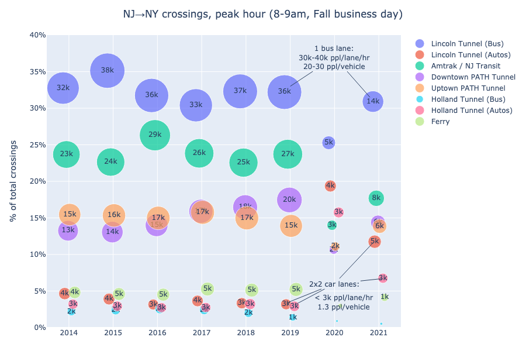

# Hudson River Crossing Transit Data
- [nymtc/](nymtc): Analysis of [NYMTC's "Hub Bound Travel" reports][NYMTC HBT reports] about vehicle and passenger volumes into Manhattan's Central Business District (below 60th St).
- [path/](path): Cleaned + Plotted [Port Authority data]

### Hudson River crossings by mode, peak hour: 

More plots/data in [nymtc/](nymtc).

### PATH ridership over time 

More plots/data in [path/](path).

[NYMTC HBT reports]: https://www.nymtc.org/en-us/Data-and-Modeling/Transportation-Data-and-Statistics/Publications/Hub-Bound-Travel
[Port Authority data]: https://www.panynj.gov/path/en/about/stats.html
