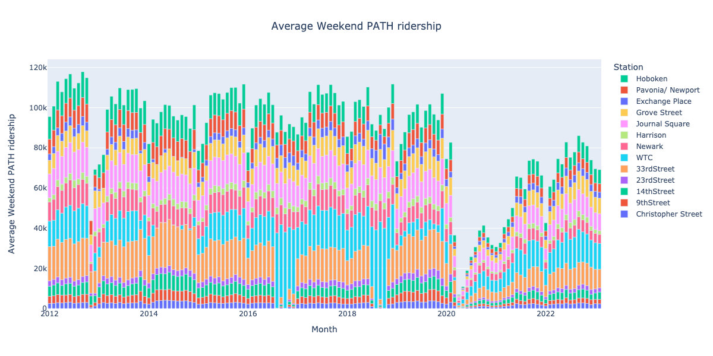
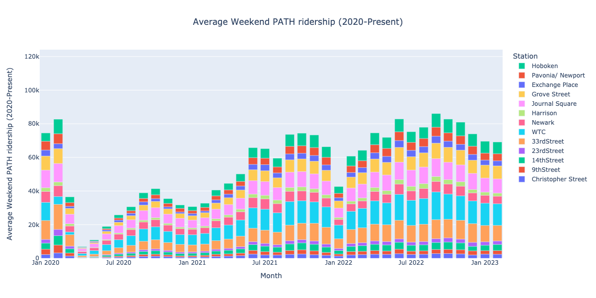
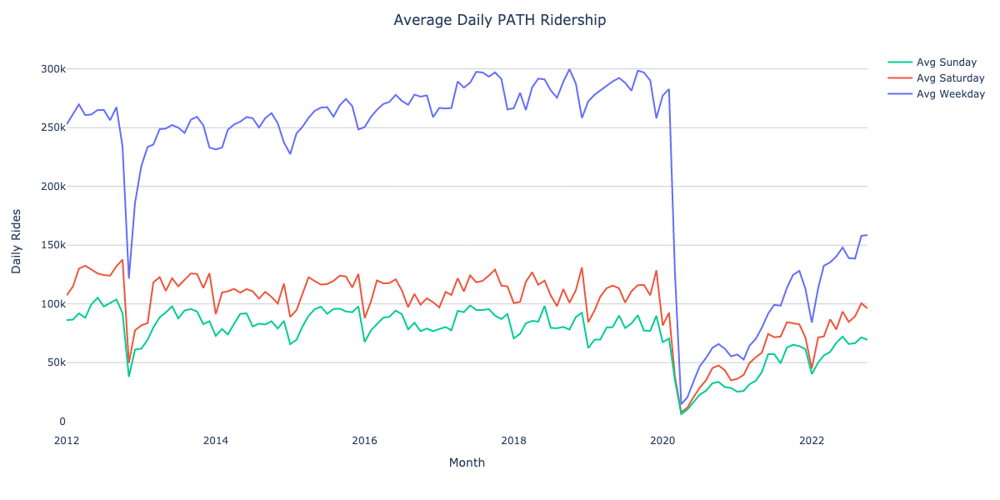
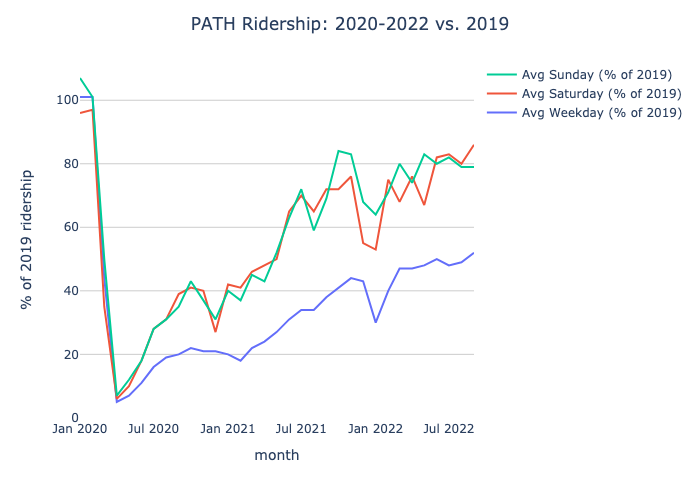

# PATH ridership stats
Cleaned + Plotted Port Authority data from https://www.panynj.gov/path/en/about/stats.html

## Cleaned data
- [`data/all.pqt`]
- [`data/all.xlsx`]
- [Google Sheet](https://docs.google.com/spreadsheets/d/1u84kVHEjvqByCu8Jb78D9f7TXbahoOe0/edit)

### Jan 2012 – Feb 2023


### Closer look at 2020-Present


### Weekends only


### Weekends (2020-Present)


### Weekdays, Grouped by Month


### Weekends, Grouped by Month


### Weekdays vs. Weekends


### Weekdays vs. Weekends, compared to 2019



## Methods

### PATH Monthly Data

#### 1. Download "PATH Ridership Reports (By Month)"
- from https://www.panynj.gov/path/en/about/stats.html
- to [`data/`](data/)

#### 2. Use [Tabula] to extract tables


Resulting templates in [`templates/`](templates).

#### 3. Process each year's data, output `.pqt`s
See:
- [`monthly.ipynb`](monthly.ipynb)
- outputs in [`data/*.pqt`](data/)

#### 4. Combine all years' data
- See [`months.ipynb`](months.ipynb)
- Output [`data/all.pqt`], [`data/all.xlsx`], [`img/weekdays.png`](img/weekdays.png)

### Bridge & Tunnel Data

Merge per-year PDFs into one:
```bash
/opt/homebrew/bin/gs \
  -o merged.pdf \
  -sDEVICE=pdfwrite \
  -dPDFFitPage \
  -g12984x10033 \
  -dPDFSETTINGS=/prepress \ 
  traffic-e-zpass-usage-20*
```
cf. [SO](https://stackoverflow.com/a/28455147/544236).


[`data/all.pqt`]: data/all.pqt
[`data/all.xlsx`]: data/all.xlsx
[Tabula]: https://tabula.technology/
