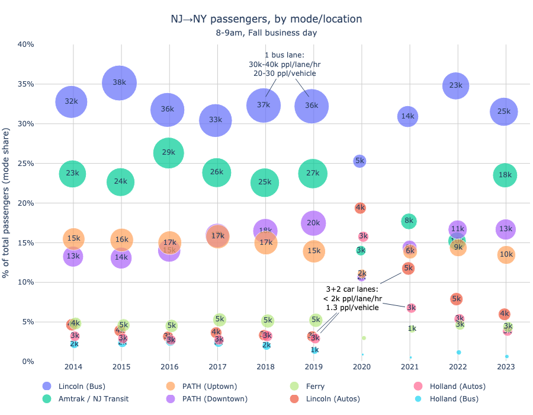
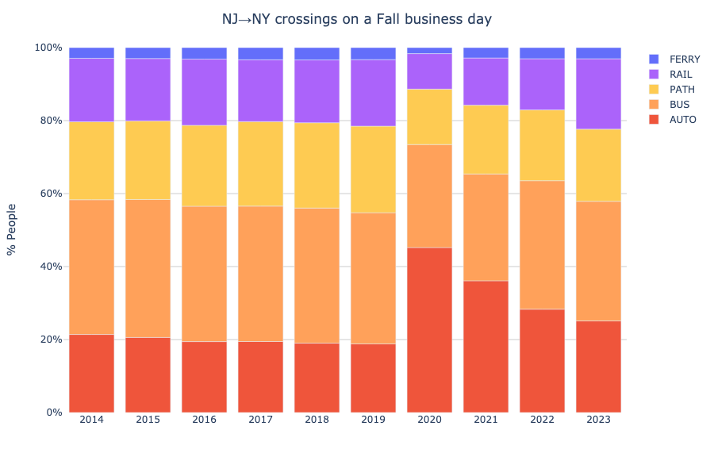

# Hudson River Crossing Transit Data
Analysis of [NYMTC's "Hub Bound Travel" reports][NYMTC HBT reports] about vehicle and passenger volumes into Manhattan's Central Business District (below 60th St).

Reports are also mirrored [here][gdrive] in [Hudson County Complete Streets]' Google Drive.

<!-- toc -->
- [Hudson River crossings by mode, peak hour:](#peak)
- [Hudson River crossings by mode, 24hr:](#day)
- [Hudson River crossings by mode %, 24hr:](#day_pct)
<!-- /toc -->

## Hudson River crossings by mode, peak hour: 

## Hudson River crossings by mode, 24hr: 

## Hudson River crossings by mode %, 24hr: 

[NYMTC HBT reports]: https://www.nymtc.org/en-us/Data-and-Modeling/Transportation-Data-and-Statistics/Publications/Hub-Bound-Travel
[Hudson County Complete Streets]: https://hudcostreets.org
[gdrive]: https://drive.google.com/drive/folders/16YYlcHoCA3scyvCNXfBKEf0P_41IRpJS
