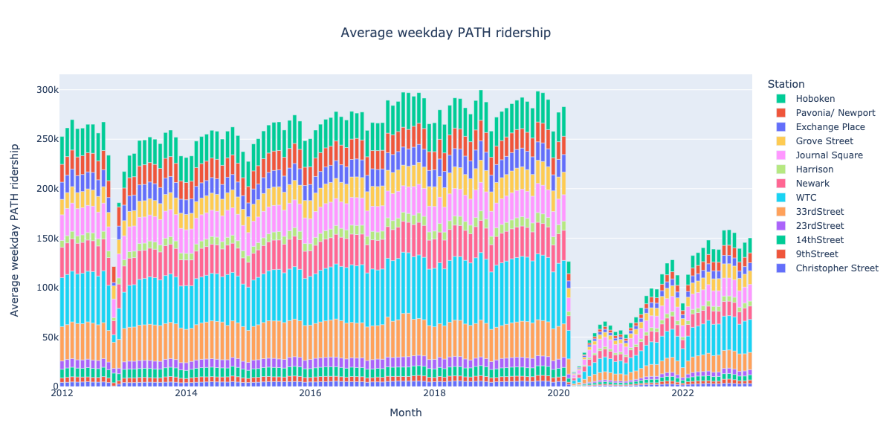

# PATH ridership stats

## Steps

### 1. Download "PATH Ridership Reports (By Month)"
From https://www.panynj.gov/path/en/about/stats.html

### 2. Use [Tabula] to extract tables

Resulting templates in [`templates/`](templates).

### 3. Process each year's data, output `.pqt`
See [`monthly.ipynb`](monthly.ipynb)

### 4. Combine all years' data
- See [`months.ipynb`](months.ipynb)
- Output [`data/all.pqt`](data/all.pqt), [`img/weekdays.png`](img/weekdays.png)

[Tabula]: https://tabula.technology/
