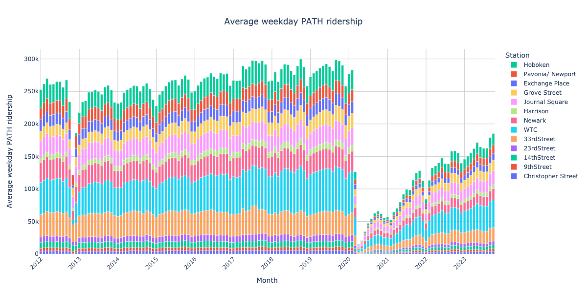
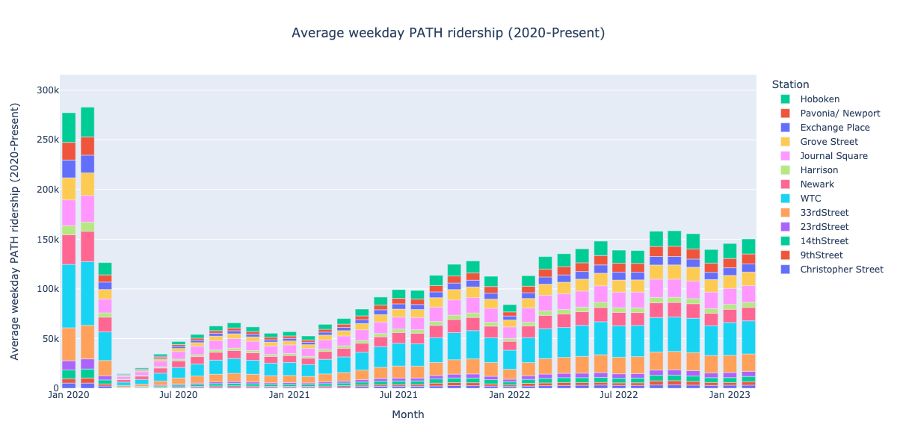
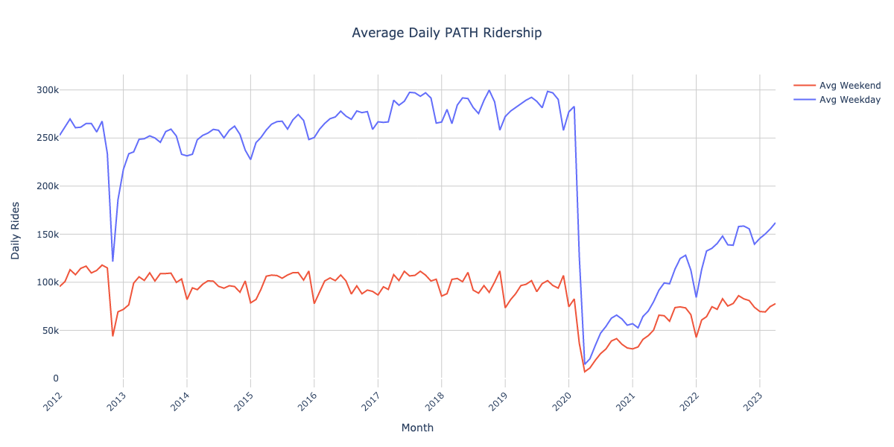
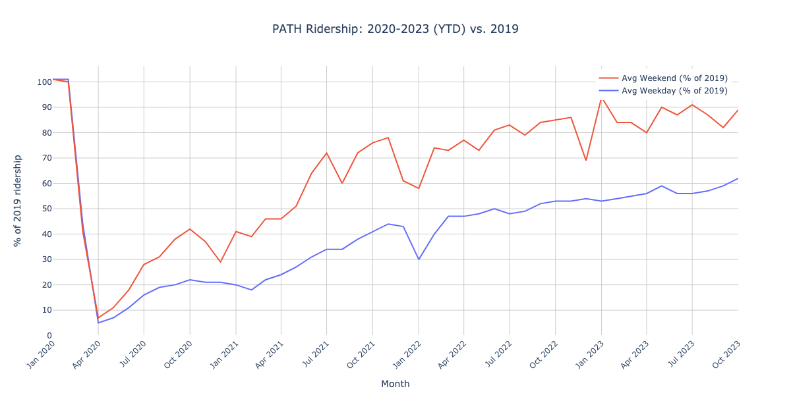
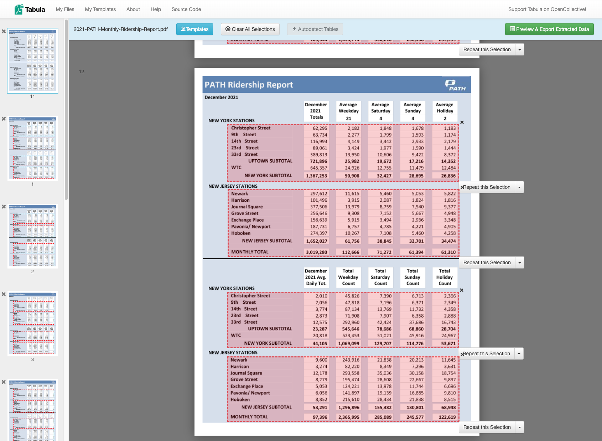

# PATH ridership stats
Cleaned + Plotted Port Authority data from https://www.panynj.gov/path/en/about/stats.html

- [Cleaned data](#data)
    - [Jan 2012 – Oct 2023](#weekdays)
    - [Closer look at 2020-Present](#weekdays_2020)
    - [Weekends only](#weekends)
    - [Weekends (2020-Present)](#weekdays_2020)
    - [Weekdays, Grouped by Month](#weekday_month_grouped)
    - [Weekends, Grouped by Month](#weekend_month_grouped)
    - [Weekdays vs. Weekends](#week_end_cmp)
    - [Weekdays vs. Weekends, compared to 2019](#week_end_cmp_pct)
- [Methods](#methods)
    - [PATH Monthly Data](#path-data)
        - [1. Download "PATH Ridership Reports (By Month)"](#download-data)
        - [2. Use Tabula to extract tables](#use-tabula)
        - [3. Process each year's data, output `.pqt`s](#process-data)
        - [4. Combine all years' data](#combine-data)
    - [Bridge & Tunnel Data](#bridge_tunnel)

## Cleaned data <a id="data"></a>
- [`data/all.pqt`]
- [`data/all.xlsx`]
- [Google Sheet](https://docs.google.com/spreadsheets/d/1u84kVHEjvqByCu8Jb78D9f7TXbahoOe0/edit)

### Jan 2012 – Oct 2023 <a id="weekdays"></a>


### Closer look at 2020-Present <a id="weekdays_2020"></a>


### Weekends only <a id="weekends"></a>


### Weekends (2020-Present) <a id="weekdays_2020"></a>


### Weekdays, Grouped by Month <a id="weekday_month_grouped"></a>


### Weekends, Grouped by Month <a id="weekend_month_grouped"></a>


### Weekdays vs. Weekends <a id="week_end_cmp"></a>


### Weekdays vs. Weekends, compared to 2019 <a id="week_end_cmp_pct"></a>


As of October 2023:
- weekday ridership was 62% of 2019
- weekend ridership was 90% of 2019

Service remains down in both cases, so it's not apples to apples.

## Methods <a id="methods"></a>

### PATH Monthly Data <a id="path-data"></a>

#### 1. Download "PATH Ridership Reports (By Month)" <a id="download-data"></a>
- from https://www.panynj.gov/path/en/about/stats.html
- to [`data/`](data/)

#### 1b. Use [Tabula] to extract tables <a id="use-tabula"></a>

This only has to be done once, the resulting templates are saved in [`templates/`](templates).



#### 2. Process each year's data, output `.pqt`s <a id="process-data"></a>
See:
- [`monthly.ipynb`](monthly.ipynb)
- outputs in [`data/*.pqt`](data/)

#### 3. Combine all years' data <a id="combine-data"></a>
- See [`months.ipynb`](months.ipynb)
- Output [`data/all.pqt`], [`data/all.xlsx`], [`img/weekdays.png`](img/weekdays.png)

### Bridge & Tunnel Data <a id="bridge_tunnel"></a>

Merge per-year PDFs into one:
```bash
/opt/homebrew/bin/gs \
  -o merged.pdf \
  -sDEVICE=pdfwrite \
  -dPDFFitPage \
  -g12984x10033 \
  -dPDFSETTINGS=/prepress \ 
  traffic-e-zpass-usage-20*
```
cf. [SO](https://stackoverflow.com/a/28455147/544236).


[`data/all.pqt`]: data/all.pqt
[`data/all.xlsx`]: data/all.xlsx
[Tabula]: https://tabula.technology/
